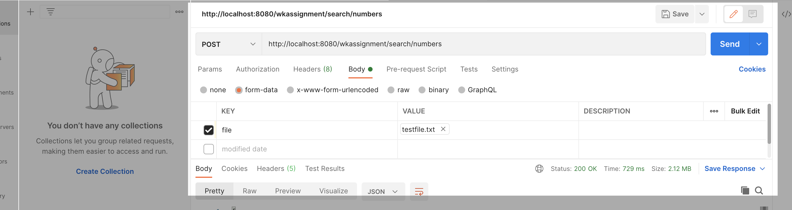

# number-search-service

## Functional description

Application developed in [Spring Boot](http://projects.spring.io/spring-boot/) which has a Rest POST API to which we can upload text document. The API will return response in JSON, which will contain list of all the Numbers present in the  document, and each number will have there respective list of position details which will give where it was found throughout the document.


## What You Need

For building and running the application you need:

- [openjdk version 11](https://www.oracle.com/java/technologies/javase-jdk11-downloads.html)
- [Apache Maven 3.8.1](https://maven.apache.org)
- IDE [Spring Tool Suite](https://spring.io/guides/gs/sts/) OR [Eclipse](https://www.eclipse.org/getting_started/)
- [POSTMAN](https://www.postman.com/downloads/)
- [Docker](https://docs.docker.com/get-docker/)(optional)


## Running the application locally

There are several ways to run a Spring Boot application on your local machine. Below are the choices, by which our application will get stated at port `8080`.

-Using Docker
* Login into docker application.
* In Terminal, navigate to root directory `number-service`, run following command in terminal to create image:

```shell
docker build -t number-service:1.0 .
```
* To run the generated image run following command in terminal:

```shell
docker run -d -p 8080:8080 -t number-service:1.0
```


-Using custom shell script
* WE will find custom shell script in root directory `numservice.sh`.
* In Terminal, navigate to root folder `number-service` and run command:

```shell
bash numservice.sh
```

-Manually
* In terminal, navigate to root directory `number-service` and rum command:

```shell
mvn clean install
```
* Execute the `main` method in the `com.wkassignment.search.numberservice.NumberServiceApplication` class from your IDE.


## The Application Starts

* A LOG file will get generated in root directory named `wkassignmentlogs/searchnumlogs.log`, which will store all the logs at INFO level.
* In /target jar will get created named number-service-0.0.1.jar.
* The application will run at PORT 8080.
* Following POST endpoint will be exposed: `http://localhost:8080/wkassignment/search/numbers`


* This endpoint will accept file as `form-data` input, and will return a JSON response which will have list of all the numbers and its respective details.


## Endpoint Usage

* SWAGGER Url: `http://localhost:8080/wkassignment/swagger-ui/`

*  In POSTMAN tool, change the REST method to "POST", and put below url:
	`http://localhost:8080/wkassignment/search/numbers`.
* In the body option, select `form-data`. Add `key` as `file` and attach the text file in `value`.

<div align="center">
     
</div>


## Info about Http Status

Below are the HTTP statuses returned by application:

* The API will return HTTP status `200` OK if it finds number successfully in the text document.
* The API will return HTTP status `204` NO CONTENT FOUND, when it do not find any number.
* The API will return HTTP status `500` INTERNAL SERVER ERROR Status, and custom exception when 	format of the file is not "plain/text" or if the file is empty.


## For additional points of assignment

* We can extend this functionality easily to use HTML/XML document. There is a Java library 		`Jsoup`, which will take care of removing the HTML/XML tags.We need to add the dependency of  	`Jsoup` in pom.xml, and we will use the same codebase to get output (Accept we would just 	add one more condition to accept HTML/XML as valid format).
* Still thinking on good solution it.. :(
* To deploy the application in production environment:
Assuming: We will be deploying application to AWS, say Elastic Bean Stalk.
    * Need to use CICD tool, e.g. Jenkins or Travis CI, which will be automated pipeline.
    * This automated pipeline will act as binding between gitHub account, Docker, EBS.
    * Whenever we will push code, the CICD tool will build, run and package our application.
    * It will use the Dockerfile in the application to create the image of our application, and the image will be pushed in repository.
    * The CICD tool then will use this image to run the application on AWS EBS.

## Possible Improvements


-The test cases could be written better which would cover every conditional branch and 	Exception. Also we can implement REST Assured test cases for testing REST services.

-Use of Lombok for cleaner code, it will remove the need to add getters and setters, constructors, toString..etc.

-Report for test cases coverage can be included to check the percentage of coverage eg. Jacoco report.

-There is a very basic configuration of SWAGGER implemented, it can be well documented.